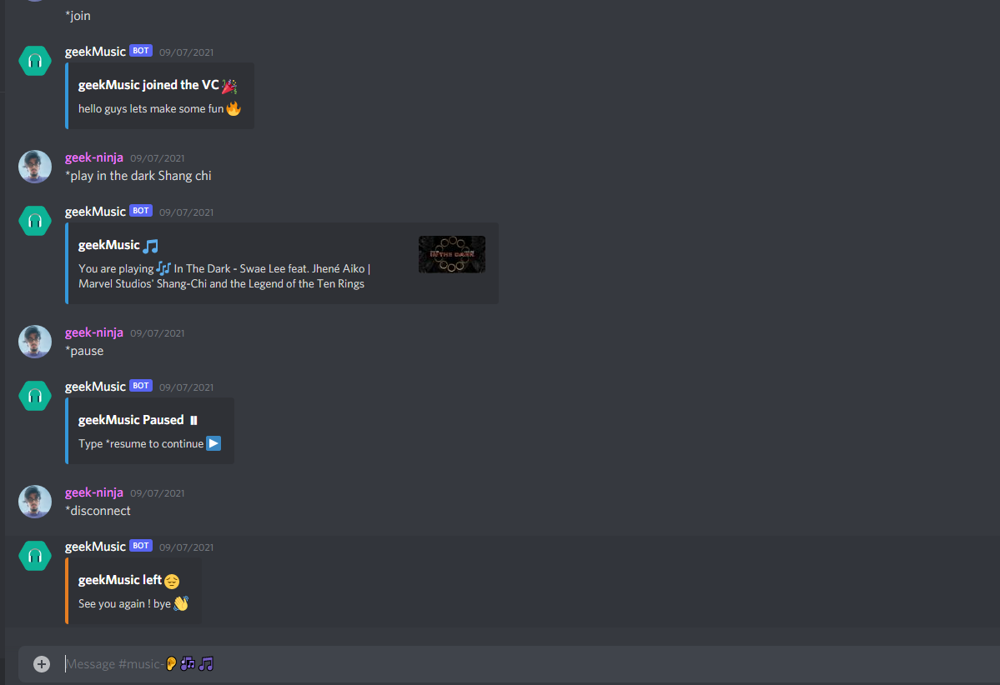

# discord-music-bot
Simple music bot made using python and hosted in Heroku server.

<h2>how to register bot in discord</h2>
<p>First enter to the following link</p>
https://discord.com/developers/applications

<p>create your bot</p>
<p>you can give your bot name and image</p>
<p>check some of the permissions</p>
<p>Now go to Oauth2 section select bot in scopes section and admin in bot permisssions</p>
<p>Then copy the bot url at the end of the scopes section and use to add in your server</p>


<p>For more information you can follow the youtube link</p>
https://www.youtube.com/watch?v=jHZlvRr9KxM&t=52s&ab_channel=MaxA

<h2>Now let's add functions to the bot using python</h2>

<p>pip3 install requirements.txt</p>
<p>The above command will install all the required modules for the bot</p>
<p>Now download the ffmpeg package from the below site and make it global using environmental variable</p>
https://ffmpeg.org/download.html

<p>Now replace your generated TOKEN in the main.py file at the end </p>
<p>Now just run the main.py file to enjoy the bot</p>

<h2>Commands of the bot</h2>
<p> *join  (To add bot to the vc  but make sure user must be present in the vc) </p>

```python
	@commands.command()
	async def join(self,ctx):
		welcom = discord.Embed(
			title = 'geekMusic joined the VC 🎉',
			description = 'hello guys lets make some fun 🔥',
			colour = discord.Colour.blue()
			)
		error = discord.Embed(
			title = 'geekMusic facing some error ❌',
			description = 'Make sure to add the bot to VC',
			colour = discord.Colour.blue()
			)
		if ctx.author.voice is None:
			await ctx.send(embed = error)
		voice_channel = ctx.author.voice.channel
		if ctx.voice_client is None:
			await voice_channel.connect()
			await ctx.send(embed = welcom)
		else:
			await voice_client.move_to(voice_channel)
			await ctx.send(embed = welcom)
```

<p> *play song_name (To play the song)</p>

```python
	@commands.command()
	async def play(self,ctx,*song_name):
		song_name = list(song_name)
		song_name = ' '.join(song_name)
		result = YoutubeSearch(song_name,max_results = 1).to_dict()
		result = result[0]
		song_title = result['title']
		song_thumbnail = result['thumbnails']
		song_thumbnail_url = song_thumbnail[0]
		prefix = 'https://www.youtube.com'
		url = result['url_suffix']
		url = prefix + url
		
		ctx.voice_client.stop()
		FFMPEG_OPTIONS = {'before_options': '-reconnect 1 -reconnect_streamed 1 -reconnect_delay_max 5', 'options': '-vn'}
		YDL_OPTIONS = {
		    'format': 'bestaudio/best',
		    'reactrictfilenames': True,
		    'noplaylist': True,
		    'nocheckcertificate': True,
		    'ignoreerrors': False,
		    'logtostderr': False,
		    'quiet': True,
		    'no_warnings': True,
		    'default_search': 'auto',
		    # bind to ipv4 since ipv6 addreacses cause issues sometimes
		    'source_addreacs': '0.0.0.0',
		    'output': r'youtube-dl',
		    'postprocessors': [{
		        'key': 'FFmpegExtractAudio',
		        'preferredcodec': 'mp3',
		        'preferredquality': '320',
		    }]
		}
		vc = ctx.voice_client
		with youtube_dl.YoutubeDL(YDL_OPTIONS) as ydl:
			info = ydl.extract_info(url,download=False)
			url2 = info['formats'][0]['url']
			source = await discord.FFmpegOpusAudio.from_probe(url2,**FFMPEG_OPTIONS)
			vc.play(source)
		embed = discord.Embed(
		title = 'geekMusic 🎵',
		description = 'You are playing 🎶 ' +' '+song_title,
		colour = discord.Colour.blue()
		)
		embed.set_thumbnail(url = song_thumbnail_url)
		await ctx.send(embed = embed)
```

<p>*about (To know the rest of the commands)</p>

```python
@client.command()
async def about(ctx):
	embed = discord.Embed(
		title = 'About geekMusic',
		description = 'Am a music bot created using python and am hosted in Heroku Server',
		colour = discord.Colour.blue()
	)
	embed.set_footer(text = 'Happy Music 🎵')
	embed.set_image(url = 'https://lh3.googleusercontent.com/AQK9TbvW13eNrlGNmAWD3g_osRSLofDn42VIFLYxkh6go_rHScOAB6ZDLEpn1EEconN-aw=s85')
	embed.set_author(name = 'geekMusic', icon_url = 'https://icon-library.com/images/music-bot-icon/music-bot-icon-14.jpg')
	embed.add_field(name = 'commands',value = 'below',inline = False)
	embed.add_field(name = 'To join bot to VC',value = '*join',inline = False)
	embed.add_field(name = 'To play song',value = '*play name of the song',inline = False)
	embed.add_field(name = 'To pause ⏸︎',value = '*pause',inline = False)
	embed.add_field(name = 'To continue ⏵︎',value = '*resume',inline = False)
	embed.add_field(name = 'To kick bot out of VC',value = '*disconnect',inline = False)
	await ctx.send(embed = embed)
```





<h2>Hosting the bot to the internet using Heroku</h2>
https://dashboard.heroku.com/login
<p>firstly make your heroku account and login</p>
<p>make sure to have git installed in your pc which will help to upload files in heroku</p>
<p>Create your application</p>
<p>Then in settings of heroku add these following builpacks</p>

1) https://github.com/jonathanong/heroku-buildpack-ffmpeg-latest
2) https://github.com/alevosia/heroku-buildpack-ffmpeg
3) https://github.com/julia-otran/heroku-buildpack-ffprobe
4) https://github.com/xrisk/heroku-opus
5) https://github.com/Crazycatz00/heroku-buildpack-libopus


<p>Now open cmd and use these commands</p>

<p>$ heroku login</p>
<p>$ git init</p>
<p>$ heroku git:remote -a your_application_name_in_heroku</p>


<p>$ git add .</p>
<p>$ git commit -am "your commit message"</p>
<p>$ git push heroku master</p>


<p>For more information you can follow the below youtube link</p>

1) https://www.youtube.com/watch?v=BPvg9bndP1U&t=775s&ab_channel=TechWithTim

2) https://www.youtube.com/watch?v=u6o1yUUdc54&t=3s&ab_channel=KowaiiNeko

<p>That's it you are done</p>

<h2>Feel free to contribute to this project and make it better . </h2>
